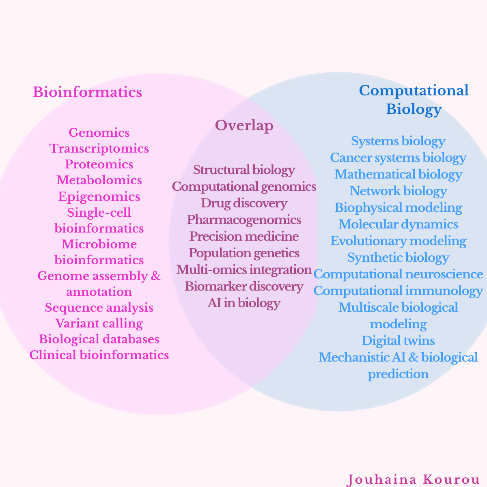

With the rapid rise of AI in biology, multi-omics, and precision medicine, the terms **Bioinformatics** and **Computational Biology** are often used interchangeably. In fact, one of the most common questions I receive is "Aren't they basically the same thing?”

In a previous post, I explained the conceptual difference. **Bioinformatics** is data-driven, developing computational tools, databases, algorithms, and pipelines to process and analyze biological data. **Computational Biology** is hypothesis-driven, using computational approaches to model, simulate, and explain biological systems.

Technically, that's correct… But I don't think that's where the real confusion lies. The confusion begins when we start talking about “research areas”.

Is clinical bioinformatics actually bioinformatics? Why is systems biology considered computational biology? Where do drug discovery, AI, or structural biology belong?

The answer is not always black and white.

Bioinformatics is centered around biological data. Its research areas focus on generating, processing, integrating, and interpreting large-scale datasets, including:

- Genomics
- Transcriptomics
- Proteomics
- Metabolomics
- Epigenomics
- Single-cell bioinformatics
- Microbiome bioinformatics
- Genome assembly & annotation
- Sequence analysis
- Variant calling
- Biological databases
- Clinical bioinformatics

On the other hand, computational biology shifts the focus from analyzing data to understanding biological systems. It aims to explain biological mechanisms, simulate complex processes, and predict biological behavior through computational models. Its major research areas include:

- Systems biology
- Cancer systems biology
- Mathematical biology
- Network biology
- Biophysical modeling
- Molecular dynamics
- Evolutionary modeling
- Synthetic biology
- Computational neuroscience
- Computational immunology
- Multiscale biological modeling
- Digital twins
- Mechanistic AI & biological prediction

Rather than stopping at **"What does the data show?"**, computational biology asks the next question ”**Why is this happening?”, “What biological mechanisms are at play?”** and **“Can we model or predict what happens next?”**

Then comes the gray area... Not every field belongs neatly to one discipline. Some research areas naturally sit at the intersection of bioinformatics and computational biology:

- Structural biology
- Computational genomics
- Drug discovery
- Pharmacogenomics
- Precision medicine
- Population genetics
- Multi-omics integration
- Biomarker discovery
- AI in biology

Whether these fields are considered bioinformatics or computational biology often depends less on the field itself and more on the scientific question being asked.

So instead of asking "Is this bioinformatics or computational biology?"; we should reframe our question to "Am I trying to analyze biological data, or am I trying to explain and predict biology?"

Because in modern research, the most impactful discoveries often happen where bioinformatics and computational biology stop being separate disciplines and start working together.

I'd love to hear your perspective. Which research area do you think is the hardest to classify?

