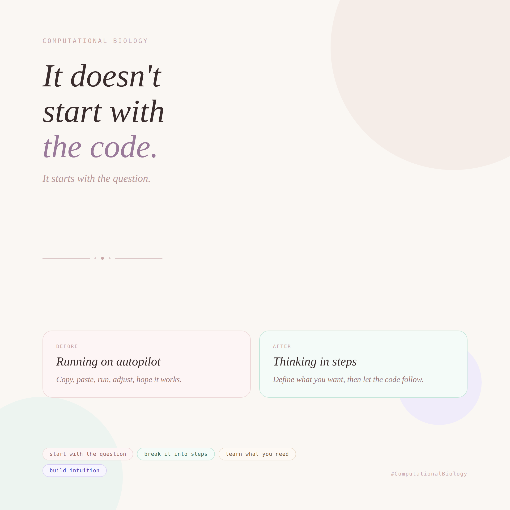

In computational biology, many of us didn’t start as programmers. Yet, at some point, we are expected to code, to run scripts, use pipelines, and work with tools in languages like Python and R. 

And often, the learning process looks like this: learn a few basics, write a few lines, copy and paste from here and there, run the code, adjust a few lines, and hope it works. And as long as it works… that’s enough.

But if someone asks us to explain the code, things become less clear.

Day after day, the confusion starts to build. You begin to wonder what you are actually doing, running on autopilot without truly understanding. And if an expert asks even a simple question, you hesitate. Because deep down, you know you are executing more than you are understanding.

No one really explains how to learn coding from scratch and how to actually understand it. So naturally, many of us feel lost.

What i have come to realize is that coding becomes much clearer when we shift our approach. 

It doesn’t start with the code, it starts with the question. 

Before writing anything, we need to ask ‘What do I want this code to do?’ ‘What problem am I trying to solve?’

Once that is clear, everything else starts to fall into place. 

From there, the process becomes more intentional.

First of all, break the problem down into small, simple steps and name them. For example, load the data, clean the data, select what matters, analyze it, and visualize the results. This way, in itself, is already computational thinking. 

Then, instead of saying ‘I wanna learn Python’, shift the question to: ‘How do I load data in Python?’… Learn what you need when you need it. 

The next crucial step is ‘DON’T MEMORIZE CODE’. 

The real shift happens when we stop running code blindly and start breaking it down. Every line has a purpose, and every function solves a specific part of a problem. 

Start asking ‘what does this line do?’ ‘Why is this function used here?’ ‘when should I use it?

In coding, every word, every line, every function has meaning. Understanding what a function does, why it is used, and when to apply it is far more valuable than simply executing it.

Then comes the foundation. Don’t start with complex scripts; they can feel overwhelming. Instead, start with simple syntax. For example, understand ‘how variables work?’ ‘How are conditions structured?’ ‘How do loops behave?’ 

And most importantly, practice them until they feel natural. Not just by writing code, but by solving small problems, until translating a biological question into code becomes intuitive.

Because coding is, at its core, pattern recognition. Repeating small patterns builds intuition. And intuition is what allows you to think in steps. 

Coding is not about knowing several functions or packages; it is about knowing when and why to use them. Because the hardest part is not coding itself, but it is learning how to translate a biological question into a sequence of logical steps, then into code.

In science, coding isn’t a tech skill, but rather a way of thinking: understand the problem, break it down, recognize the structure, then build step by step. 

Once that shift happens, everything starts to feel clearer. 

Maybe this is what we need to normalize more in science, not just use coding, but truly understand it, one step at a time. 

How did you personally learn how to code? 

